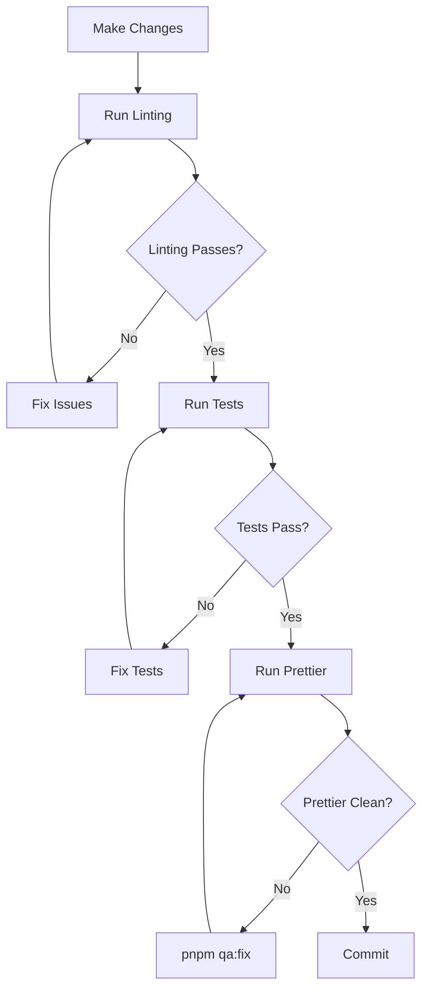

# MailPoet Development Cycle

This skill covers linting, code quality, and building assets for MailPoet development. For testing, see the separate `writing-tests` skill.

## Working Directory

This is a monorepo. Prefer the root `pnpm` scripts for common build and QA work; they wrap the plugin-level Robo tasks from the correct directory.

- **Free plugin** (default): run `pnpm <task>` from the repo root.
- **Premium plugin**: run `pnpm <task>` from `mailpoet-premium/` when a premium package script exists.
- **Robo-only helpers**: run `./do` from the relevant plugin directory only when no `pnpm` wrapper exists.

Unless you are explicitly working on the premium plugin, always default to the free plugin directory.

## When to Use This Skill

- Before committing code changes
- When running linting or code quality checks
- When setting up the development environment
- When building frontend assets
- When fixing CI failures related to code quality

## Skill Contents

| Document                                           | Purpose                                                                   |
| -------------------------------------------------- | ------------------------------------------------------------------------- |
| [code-quality.md](code-quality.md)                 | JS/TS linting (ESLint), CSS/SCSS linting (Stylelint), Prettier formatting |
| [php-coding-standards.md](php-coding-standards.md) | PHP lint, PHPCS, PHPStan static analysis                                  |

## Quick Reference

All commands below default to the free plugin. Run from the repo root.

```bash
# QA (all checks: PHP lint + PHPCS + ESLint + Stylelint)
pnpm qa

# PHP only (lint + PHPCS)
pnpm qa:php

# PHPStan static analysis
pnpm qa:phpstan

# JS/TS linting (ESLint + TypeScript check)
pnpm qa:js

# CSS/SCSS linting (Stylelint)
pnpm qa:css

# Prettier check / fix
pnpm qa:prettier
pnpm qa:fix

# Fix a single file (PHPCS or ESLint based on extension; Robo-only)
cd mailpoet && ./do qa:fix-file path/to/file.php
cd mailpoet && ./do qa:fix-file path/to/file.tsx
```

## Development Workflow



## Pre-Commit Checklist

Before committing, run these from the repo root:

- [ ] `pnpm qa` -- all PHP and frontend QA checks pass
- [ ] `pnpm qa:fix` -- formatting is clean
- [ ] Run relevant tests (see the `runnig-tests` skill for commands)

## Premium Plugin

When working on `mailpoet-premium/`, substitute the directory:

```bash
cd mailpoet-premium && pnpm qa
cd mailpoet-premium && pnpm qa:phpstan
```
